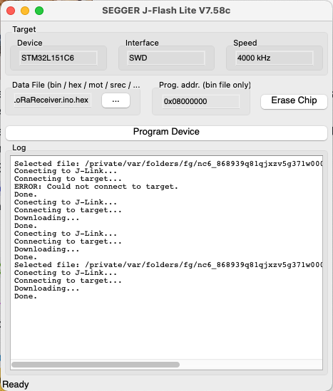
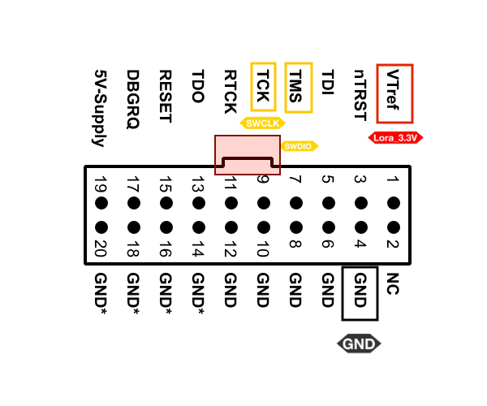
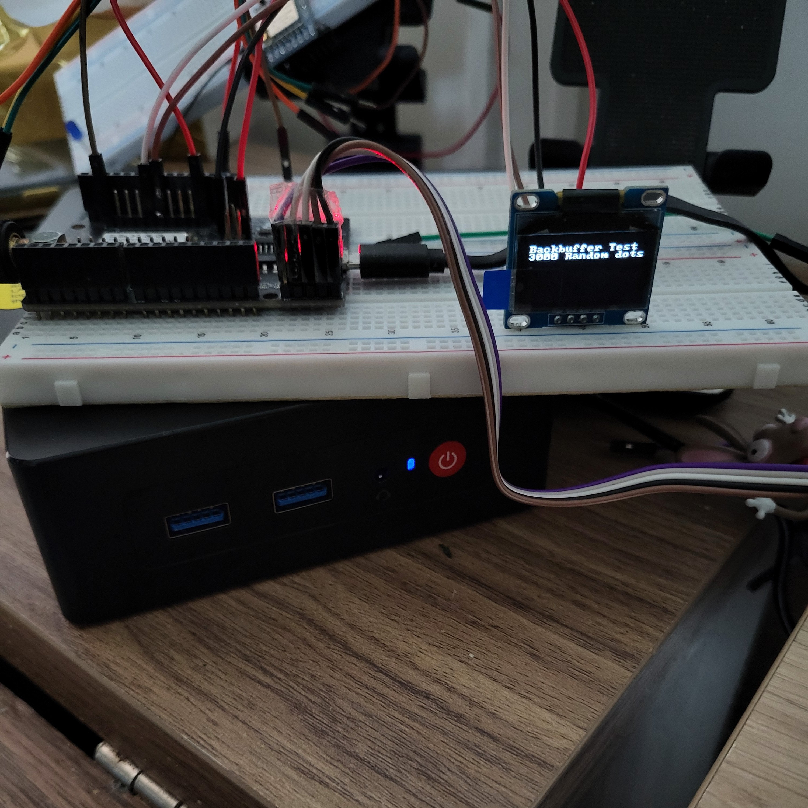
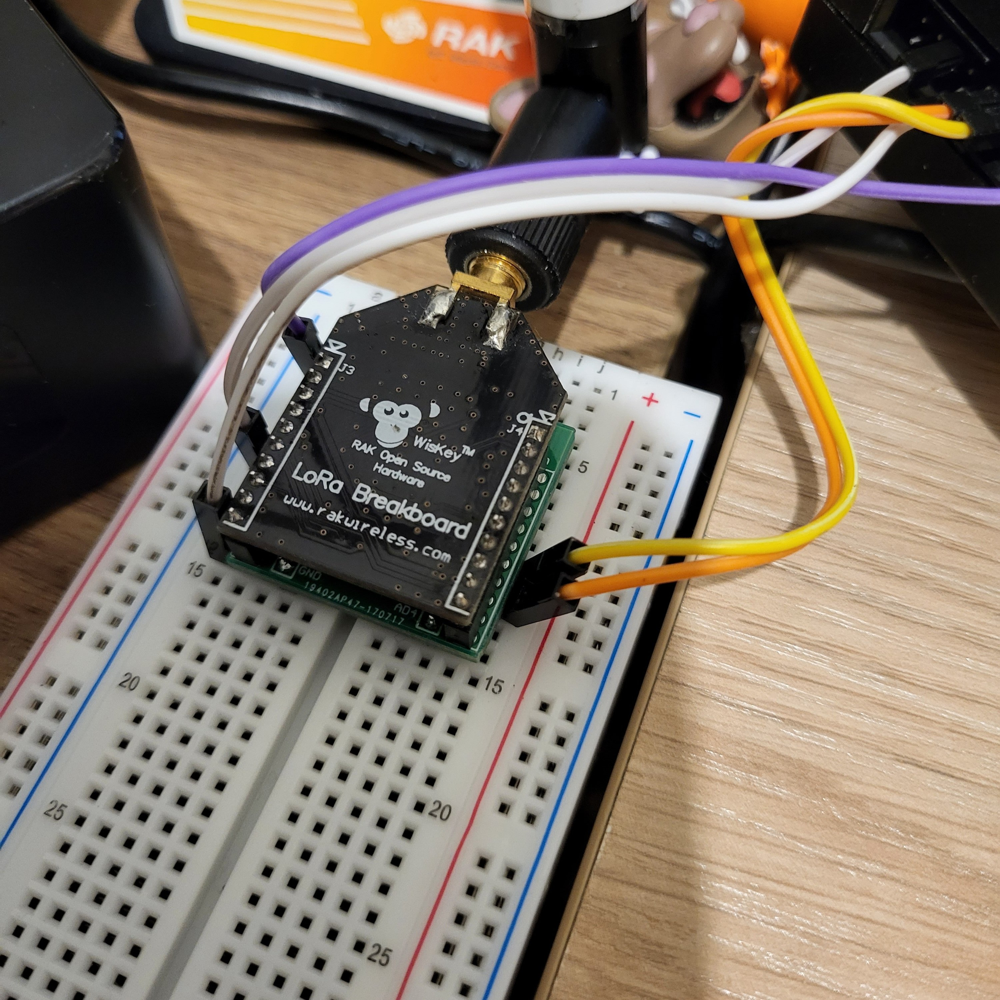
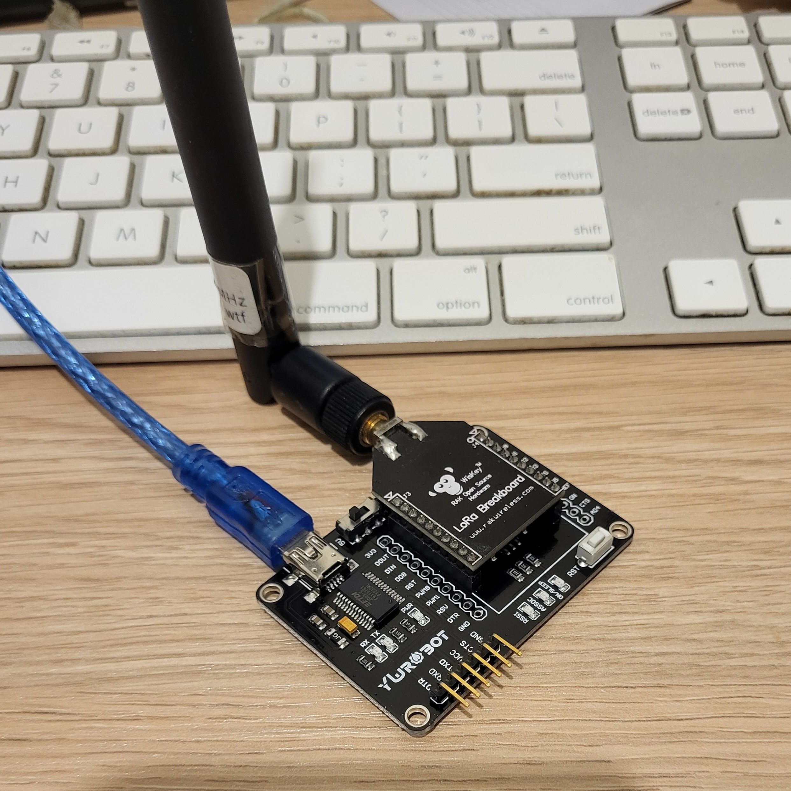
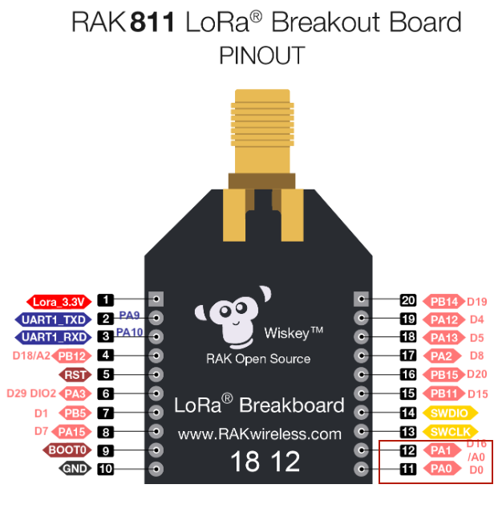
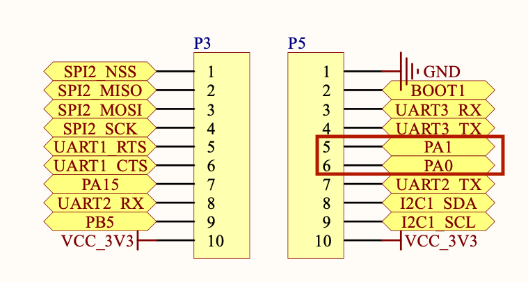

# How to Code for the RAK811 and Lora P2P in Arduino IDE

First of all, you need to install [Arduino_Core_STM32 by STM32duino](https://github.com/stm32duino/Arduino_Core_STM32). It has a LOT of STM32 MCUs enabled, including the STM32L151CB-A (don't ask) powering the RAK811.

Once this is done, there are only a couple of gotchas to make it work.

## Turn it on!

Sounds dumb but, yes, you need to turn on the SX1276 inside the RAK811.

```c
  // https://github.com/stm32duino/wiki/wiki/lora
  pinMode(RADIO_XTAL_EN, OUTPUT); //Power LoRa module
  digitalWrite(RADIO_XTAL_EN, HIGH);
```

The `RADIO_XTAL_EN` define is in the [variant file for the RAK811](https://github.com/stm32duino/Arduino_Core_STM32/blob/main/variants/STM32L1xx/L100C6Ux(A)_L151C(6-8-B)(T-U)x(A)_L152C(6-8-B)(T-U)x(A)/variant_RAK811_TRACKER.h#L40). You don't need to define it, not the others that appear below.

## Listen or Send

There is another switch that controls sending and receiving. I wrote [two short functions](https://github.com/Kongduino/RAK811_Minimal_Lora/blob/master/LoRaHelper.h#L33-L48) that do this for you.

```c
void listenMode() {
  pinMode(RADIO_RF_CRX_RX, OUTPUT);
  digitalWrite(RADIO_RF_CRX_RX, HIGH); // set LoRa to receive
  pinMode(RADIO_RF_CTX_PA, OUTPUT);
  digitalWrite(RADIO_RF_CTX_PA, LOW);
  LoRa.writeRegister(REG_LNA, 0x23); // TURN ON LNA FOR RECEIVE
  LoRa.receive();
}

void sendMode() {
  pinMode(RADIO_RF_CRX_RX, OUTPUT);
  digitalWrite(RADIO_RF_CRX_RX, LOW); // set LoRa to send
  pinMode(RADIO_RF_CTX_PA, OUTPUT);
  digitalWrite(RADIO_RF_CTX_PA, HIGH); // control LoRa by PA_BOOST
  LoRa.writeRegister(REG_LNA, 00); // TURN OFF LNA FOR TRANSMIT
}
```

Call `listenMode()` at the end of setup(), and when you are done sending. Call `sendMode()` before sending. That's about it.

## The pins

The pins required for the [LoRa library](https://github.com/sandeepmistry/arduino-LoRa) are:

```c
  // https://github.com/RAKWireless/RAK811_LoRaWAN_Arduino
  LoRa.setPins(RADIO_NSS, RADIO_RESET, RADIO_DIO_0);
```

Again these are pre-defined. For other libraries that require more pins, like LMIC, the full set is:

```c
  // nss = 26 - aka RADIO_NSS PB0
  // rxtx = 32 - aka RADIO_RF_CRX_RX PB6
  // rst = 21 - aka RADIO_RESET PB13
  // PA BOOST = 34 - AKA RADIO_RF_CTX_PA PA4
  // dio0/1/2 = 27, 28, 29
  //  RADIO_DIO_0 PA11 27
  //  RADIO_DIO_1 PB1 28
  //  RADIO_DIO_2 PA3 29
  //  RADIO_DIO_3 PH0 30
  //  RADIO_DIO_4 PC13 31
```

With this you can run most examples of the LoRa lib without issues.

## Uploading the Code

The easiest is via JLink. Connect wires to the `TMS` (SWDIO), `CLK` (SDCLK), `RST`, `Vcc` and `GND` pins. In JFlash Lite, choose `STM32L151CB-A` for the MCU. Select the `.hex` file produced by Arduino IDE during compilation – I use a small app I made for Mac OS X, but you can pick up the file system path in the logs. Click on Program Device.

### JFlash Lite



### JLink pinout



### Arduino Shield

I actually DON'T connect the Vcc pin on the Arduino Shield RAK811, as I keep the USB cable connected. So I can upload and see right away what's happening.



### XBee Breakout

On the XBee breakout I need to do a little more gymnastics.



THEN I can put it back on its base board...



## I2C

Doesn't work readily on either model, **BUT** I managed to make it work, a little, with the [BitBang_I2C library](https://github.com/bitbank2/BitBang_I2C), as shown above: the Arduino shield is running demo code from the [ss_oled library](https://github.com/bitbank2/ss_oled) (which uses BitBang_I2C, same guy). I needed to find two available pins, and went with `PA0` and `PA1`, which are available on both the Arduino Shield (P5 male headers) and the XBee (bottom right).

The BitBang_I2C library is a bit rudimentary, so you won't be able to do as much as with the regular Wire library, and mimicking its features probably requires more work than I am willing to do, but I'll poke around. Creating a `TwoWire` object with the PA0/PA1 pins doesn't work either.

### On the XBee



### On the Arduino Shield



