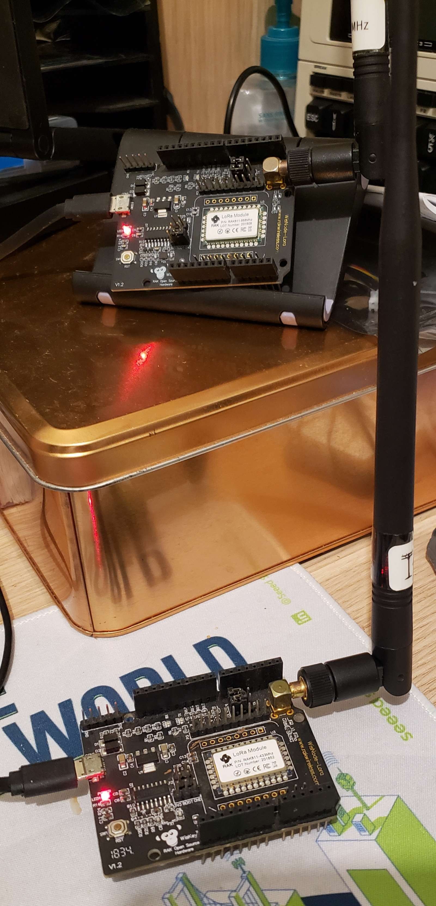
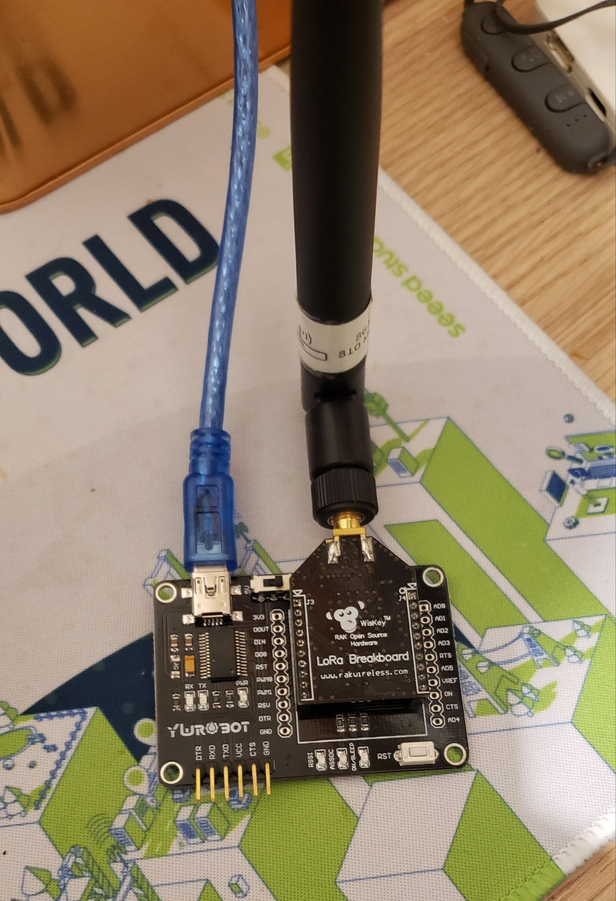

# RAK811_Minimal_Lora

The RAK811 *was* a hot product back when I discovered RAKwireless, as a customer, then a friend of the CEO and other team members. I have a few of them, in various frequency ranges (with a strong bias for 470 MHz), and still use them. They are loaded with an [AT firmware](https://downloads.rakwireless.com/LoRa/RAK811/Firmware/), which has been regularly updated until late 2020. So mostly I have been using these, whether the [Arduino shield](https://www.thethingsnetwork.org/docs/devices/rak811-wisnode-lora-module/) – which was discontinued, but you can find traces of it on the web – or the [breakout board](https://store.rakwireless.com/products/rak811-lpwan-breakout-module), as devices tethered to another machine, my Mac, some of my RPi, etc. I have a bunch of apps, from a Xojo GUI app to a headless Python script, that handle them well.





When I joined I was told *You can't reprogram it*. Which of course I took the wrong way! Turns out, yeah, back then you needed Keil to program it and use the LoRaWAN stack. But since then, there's an [Arduino BSP for STM32 devices](https://github.com/stm32duino/Arduino_Core_STM32), and although it took a while, there is now a way to use the LoRa chip inside the RAK811, an SX1276, with your library of choice. For LoRa, I use Sandeep Mistry's library, which I know well and have patched to make it work slightly better. For this example to work, you don't need to use my version, but you do need to effect a small patch:

Lines 109-110 in the original source code of the header file must be moved **before** `private` on line 97:

```c
[...]
  void dumpRegisters(Stream& out);

  uint8_t readRegister(uint8_t address);
  void writeRegister(uint8_t address, uint8_t value);

private:
  void explicitHeaderMode();
[...]
```

These 2 functions are required to play a little bit of magic on registers, and verify settings are actually set properly.

## Turning on the SX1276, and the Rx/Tx switch

With this done, you have everything to run Minimal LoRa on RAK811 devices. The settings required to make it work are mostly in a separate header file, `LoRaHelper.h`, plus on [lines 22-23](https://github.com/Kongduino/RAK811_Minimal_Lora/blob/master/RAK811_Minimal_Lora.ino#L22-L23) of the ino sketch:

```c
void listenMode() {
  pinMode(RADIO_RF_CRX_RX, OUTPUT);
  digitalWrite(RADIO_RF_CRX_RX, HIGH); // set LoRa to receive
  pinMode(RADIO_RF_CTX_PA, OUTPUT);
  digitalWrite(RADIO_RF_CTX_PA, LOW);
  LoRa.writeRegister(REG_LNA, 0x23); // TURN ON LNA FOR RECEIVE
  LoRa.receive();
}

void sendMode() {
  pinMode(RADIO_RF_CRX_RX, OUTPUT);
  digitalWrite(RADIO_RF_CRX_RX, LOW); // set LoRa to send
  pinMode(RADIO_RF_CTX_PA, OUTPUT);
  digitalWrite(RADIO_RF_CTX_PA, HIGH); // control LoRa by PA_BOOST
  LoRa.writeRegister(REG_LNA, 00); // TURN OFF LNA FOR TRANSMIT
}

[...]

  pinMode(RADIO_XTAL_EN, OUTPUT); //Power LoRa module
  digitalWrite(RADIO_XTAL_EN, HIGH);
```

## Minimal LoRa Commands

This version of Minimal LoRa comes with a subset of the commands available in other versions. It does come with my new commands engine, which is way easier to use and extend.

```
Available commands: 9
 . help: Shows this help.
 . lora: Gets the current LoRa settings.
 . fq: Gets/sets the working frequency.
 . bw: Gets/sets the working bandwidth.
 . sf: Gets/sets the Mspreading factor.
 . cr: Gets/sets the working coding rate.
 . tx: Gets/sets the Transmission Power.
 . ap: Gets/sets the auto-ping rate.
 . p: Sends a ping packet.
```

Commands start with a `/`, so `/fq 469.125`, `/bw 6`, etc. Anything else is considered as a message to be sent.

On the subject of BW, the bandwidth, and SF, the spreading factor. Contrary to LoRaWAN, which uses only a subset of LoRa's BW range, and only in a limited number of SF/BW combinations, in LoRa you can do (at least technically, what the law in your country might be... different) pretty much what you want, and use the whole range of BW settings:

```c
float myBWs[10] = {7.8, 10.4, 15.63, 20.83, 31.25, 41.67, 62.5, 125, 250, 500};
```

You can select independently any of the 10 BW values, `/bw 0` to `/bw 9`, and SF 6 to 12, knowing that `SF 6` is for special uses.

## The `TRUST_BUT_VERIFY` directive

If you have doubts about settings being applied properly, uncomment the `TRUST_BUT_VERIFY` define, in `LoRaHelper.h`, and recompile. When setting a new SF, BW, CR or frequency, the code will verify by reading the LoRa registers – hence the need, among other reasons, for the patch to the library...

This is also used during startup, when setting up every parameter:

```
RAK811 Minimal LoRa
 - cmdCount: 9
 - Started LoRa @ 470.000 MHz.
 - Frequency: 469.999 MHz ---> All good...
   Frequency calculation is slightly imprecise...
 - txPower: 20
 - preamble: 8
 - SF: 12
 . SF: 12 ---> All good...
 - BW: 7 / 125.00 KHz
 . BW: 7 [125.000 KHz] ---> All good...
 - CR 4/5
 . CR: 4/5 ---> All good...
```

Note the calculation of the frequency from the SX1276's registers is a bit imprecise (floats and all that), so in that particular case I allow a variation of 1 Hz.

## AUTO PING

You can have the device send a PING automatically every x seconds (at least 10, but do try to space the PINGs out a little more than that). This is quite useful for testing: you set up one a static device to ping every minute, for example, and take another one (connected to a computer or else to get the information) and see whether the pings are coming in.

```
Evaluating: `/ap 30`
AutoPING set to: ON, every 30 secs.
Evaluating: `/lora`
Current settings:
 - Frequency: 470.00 MHz
 - BW: 7, ie 125.00KHz
 - SF: 12
 - CR 4/5
 - Tx power: 20
 - AutoPING: ON, every 30 secs.
Sending `This is a not so short PING!` done!
Time: 1648 ms.
```
## LoRa settings

The `lora` command shows all settings at once, as illustrated above.

## AES

I tested, separately, that AES worked on the RAK811 – no reason it shouldn't, but... – and will add commands to set up a key, Iv (NEVER reuse an Iv, or use a predictable Iv!), and switch AES on/off. HMAC could also be added at some point.

At startup, the `setup()` code runs a small AES self-test. It is now using my [LoRandom library](https://github.com/Kongduino/LoRandom), which produces TRNG (or as T as possible anyway) through the RssiWideBand register of the LoRa chip.

```
AES Test!
 - Generating Random Numbers with LoRandom
pKey:
   +------------------------------------------------+ +----------------+
   |.0 .1 .2 .3 .4 .5 .6 .7 .8 .9 .a .b .c .d .e .f | |      ASCII     |
   +------------------------------------------------+ +----------------+
 0.|9f 74 a0 44 f4 c8 a7 c4 e2 2e 57 81 69 cd a6 19 | |.t.D......W.i...|
   +------------------------------------------------+ +----------------+
IV:
   +------------------------------------------------+ +----------------+
   |.0 .1 .2 .3 .4 .5 .6 .7 .8 .9 .a .b .c .d .e .f | |      ASCII     |
   +------------------------------------------------+ +----------------+
 0.|70 7f b0 ea 07 33 bd 35 42 7f 2c f0 79 ca 49 dd | |p....3.5B.,.y.I.|
   +------------------------------------------------+ +----------------+
Plain Text:
   +------------------------------------------------+ +----------------+
   |.0 .1 .2 .3 .4 .5 .6 .7 .8 .9 .a .b .c .d .e .f | |      ASCII     |
   +------------------------------------------------+ +----------------+
 0.|48 65 6c 6c 6f 20 75 73 65 72 21 20 54 68 69 73 | |Hello user! This|
 1.|20 69 73 20 61 20 70 6c 61 69 6e 20 74 65 78 74 | | is a plain text|
 2.|20 73 74 72 69 6e 67 21 00                      | | string!.       |
   +------------------------------------------------+ +----------------+
CBC Encoded: 41 vs 48
   +------------------------------------------------+ +----------------+
   |.0 .1 .2 .3 .4 .5 .6 .7 .8 .9 .a .b .c .d .e .f | |      ASCII     |
   +------------------------------------------------+ +----------------+
 0.|8f 66 5e 5a 1b 51 87 61 fe 4c 52 6b 96 b6 0e 07 | |.f^Z.Q.a.LRk....|
 1.|a9 7b 88 7f 71 c9 d7 2a 25 12 64 bf 47 6a 08 0a | |.{..q..*%.d.Gj..|
 2.|3b 00 a2 75 90 f8 5d eb cd 04 fd 14 e4 4d bd 2f | |;..u..]......M./|
   +------------------------------------------------+ +----------------+
1104 round / s
CBC Decoded: 48
   +------------------------------------------------+ +----------------+
   |.0 .1 .2 .3 .4 .5 .6 .7 .8 .9 .a .b .c .d .e .f | |      ASCII     |
   +------------------------------------------------+ +----------------+
 0.|48 65 6c 6c 6f 20 75 73 65 72 21 20 54 68 69 73 | |Hello user! This|
 1.|20 69 73 20 61 20 70 6c 61 69 6e 20 74 65 78 74 | | is a plain text|
 2.|20 73 74 72 69 6e 67 21 00 07 07 07 07 07 07 07 | | string!........|
   +------------------------------------------------+ +----------------+
658 round / s
```

AES has been added to the code, with `/pwd` to set up the key (16 bytes ASCII, or, preferred, 32 bytes hex-encoded binary). `/aes on` and `/aes off` turn the encryption on and off. The Iv is produced by the code every time, and sent with the ciphertext.

```
Evaluating: `/p`
This is a not so short PING from RAK811_303847183432353737002500
IV:
   +------------------------------------------------+ +----------------+
   |.0 .1 .2 .3 .4 .5 .6 .7 .8 .9 .a .b .c .d .e .f | |      ASCII     |
   +------------------------------------------------+ +----------------+
 0.|9a bb b0 dc 37 c5 dd c9 a7 93 22 34 68 87 ff 17 | |....7....."4h...|
   +------------------------------------------------+ +----------------+
Sending:
   +------------------------------------------------+ +----------------+
   |.0 .1 .2 .3 .4 .5 .6 .7 .8 .9 .a .b .c .d .e .f | |      ASCII     |
   +------------------------------------------------+ +----------------+
 0.|af bc 68 5f 31 00 ec 58 87 d0 f2 66 28 82 27 96 | |..h_1..X...f(.'.|
 1.|84 4a fc e0 28 89 72 94 89 6b 76 cf d1 aa cf 7c | |.J..(.r..kv....||
 2.|e4 f5 39 39 46 4e ff bb 04 b5 2c 25 7a 53 7b 0c | |..99FN....,%zS{.|
 3.|9f b6 19 f3 5a 08 cd 68 f5 72 06 d8 e6 a5 ac 4e | |....Z..h.r.....N|
   +------------------------------------------------+ +----------------+
Done! Time: 3288 ms.
```

I will add a command to set up the key for you, which it will show once in the Serial Monitor. You can set up the same key manually in other devices.


That's it for now, but it is already quite usable for range tests. Happy LoRaWalks!
